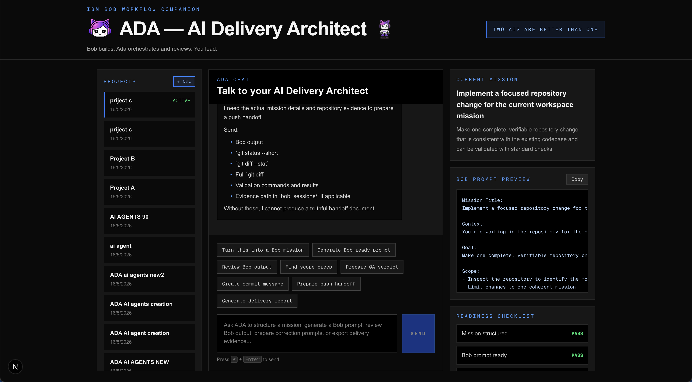
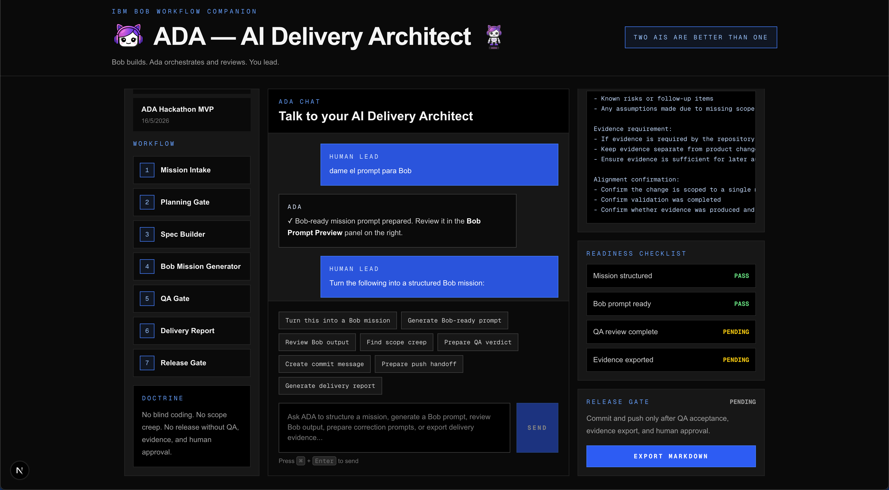

# ADA — AI Delivery Architect

**AI delivery software for IBM Bob.**

ADA turns IBM Bob coding sessions into controlled software delivery: scoped missions, persistent project context, evidence-backed QA, and safe release handoffs.

AI coding is powerful. Production delivery needs control.

ADA gives human leads a cockpit to define what should be built, generate clean Bob-ready prompts, preserve evidence, review what actually changed, and decide when work is safe to commit and push.

`Next.js 16.2.6` `React 19.2.4` `TypeScript ^5` `Tailwind CSS ^4` `Supabase JS ^2.105.4` `OpenAI ^4.77.3` `Turborepo latest` `pnpm 10.0.0` `IBM Bob Workflow`

## What ADA Is

ADA is not another code generator. It is a delivery cockpit around IBM Bob workflows.

The product organizes AI-assisted software delivery into project context, mission prompts, evidence, QA, and release control. The human lead remains in charge of product intent and approval. IBM Bob builds. ADA structures the work, reviews the delivery, and controls handoff quality.

This repository is the hackathon MVP for that workflow.

## Why ADA Exists

AI builders can move fast, but fast is not the same as ready.

In real software delivery, one actor should not define scope, implement code, review quality, approve release, and document evidence alone. That creates risk.

ADA introduces separation of duties for AI-assisted development:

- **Human Lead** defines intent, priorities, and final approval.
- **IBM Bob** implements inside the repository.
- **ADA** structures the mission, preserves context, reviews evidence, and controls release readiness.

The result is not just faster coding. It is a more disciplined delivery workflow.

QA is not release. QA asks whether the builder completed the scoped mission correctly. Release Gate asks whether the human lead allows the work to be committed and pushed.

## Built Through Its Own Workflow

ADA was built using the workflow it productizes.

The project started as a real IBM Bob Hackathon build. Bob was used as the implementation partner across the scaffold, documentation, UI, Supabase memory foundation, chat API, persistent projects, prompt routing, and structured persistence missions.

As the system grew, ADA’s own delivery doctrine became the operating model:

1. Define a narrow mission.
2. Generate a Bob-ready prompt.
3. Let Bob build.
4. Export evidence.
5. Review the real repository state.
6. Fix scope or quality issues.
7. Commit only after validation.

When IBM Bob budget ran out, recovery work was completed outside IBM-provided services and documented transparently. That moment reinforced the product thesis: AI builders need an independent delivery control layer.

## Problem

AI coding tools are excellent builders, but they are not delivery systems.

Without a control layer, AI-assisted development becomes messy:

- prompts are scattered across chats,
- scope expands without approval,
- summaries are treated as truth,
- evidence is missing,
- validation is inconsistent,
- release readiness is unclear.

That is not how production software should ship.

## Solution

ADA adds a delivery cockpit around IBM Bob.

It converts product intent into structured build missions, keeps project context persistent, routes long implementation prompts into a dedicated Bob Prompt Preview, tracks evidence, supports independent QA review, and gives the human lead a clear release gate.

Bob executes build work. ADA reviews the evidence, checks readiness, and records the delivery decision. The human lead remains the final authority on commit and push.

```txt
Human Lead
→ ADA Mission Intake
→ Bob-ready Prompt
→ IBM Bob Execution
→ Evidence Export
→ ADA QA Review
→ Release Gate
→ Commit / Push
```

## Current Features

- Persistent projects and workspaces
- Persistent project chat history
- ADA chat API for server-side reasoning
- Bob Prompt Preview panel
- Prompt and chat separation
- Structured artifacts persisted in Supabase
- Active mission persistence tied to Bob prompt generation
- Readiness checklist derived from durable state
- Delivery report export
- ADA chat hydrated from durable artifacts and project memory
- Evidence workflow in `bob_sessions/`
- Server-side Supabase architecture
- Source-of-truth docs for scope, workflow, and evidence
- Favicon and product identity assets

## Tech Stack

| Layer | Technology | Version Source |
| --- | --- | --- |
| Framework | Next.js App Router | `next` `16.2.6` from `apps/web/package.json` |
| UI | React | `react` / `react-dom` `19.2.4` from `apps/web/package.json` |
| Language | TypeScript | `typescript` `^5` in `apps/web/package.json`; `latest` in root and `packages/shared` |
| Styling | Tailwind CSS | `tailwindcss` `^4` from `apps/web/package.json` |
| Database client | Supabase JS | `@supabase/supabase-js` `^2.105.4` from `apps/web/package.json` |
| Server state | Next.js API routes | implemented in `apps/web/app/api/ada` |
| LLM layer | OpenAI-compatible API | `openai` `^4.77.3` from `apps/web/package.json` |
| Monorepo | Turborepo + pnpm | `turbo` `latest` and `pnpm@10.0.0` from root `package.json` |
| Shared package | `@ada/shared` | workspace package `0.1.0` |
| Evidence workflow | IBM Bob session exports | repository workflow in `bob_sessions/` |

For exact package versions, see `package.json`, `apps/web/package.json`, `packages/shared/package.json`, and `pnpm-lock.yaml`.

## Repository Structure

- `apps/web`
  The main ADA cockpit application.
- `apps/web/components`
  UI building blocks including the cockpit, chat, workflow sidebar, and context panel.
- `apps/web/app/api/ada`
  Server-side API routes for chat, workspaces, messages, artifacts, and missions.
- `apps/web/lib/ada`
  ADA-specific types, prompt logic, context building, and durable state helpers.
- `supabase/migrations`
  The current MVP schema foundation.
- `docs`
  Source-of-truth product, workflow, and evidence documentation.
- `bob_sessions`
  IBM Bob task histories, recovery notes, and consumption evidence for the hackathon.
- `packages/shared`
  Shared package surface for reusable types and constants.

## Data Model

ADA currently uses these tables:

- `ada_workspaces`
  Project containers for isolating mission and chat state.
- `ada_messages`
  Persistent project chat history.
- `ada_artifacts`
  Durable Bob prompts, QA artifacts, delivery reports, and release artifacts.
- `ada_missions`
  Active mission state for the current scoped work.
- `ada_memory`
  Deterministic workspace memory summary derived from durable artifacts and mission state.

ADA chat is hydrated from durable workspace artifacts and project memory before responding. Artifacts remain the source of truth; `ada_memory` provides a compact summary layer for decisions, constraints, and pending items.

## Evidence and Hackathon Workflow

IBM Bob evidence is preserved in `bob_sessions/`. Evidence files include task history exports, recovery notes, and consumption screenshots tied to the build process.

This repository is intentionally honest about how the product was completed:

> IBM Bob was used meaningfully across the build, and Bob evidence is preserved. After Bob budget was exhausted, recovery fixes were completed outside IBM-provided services.

That evidence model is part of the product itself. ADA is designed to treat AI build output as something that must be reviewed, validated, and documented before release.

## Product Screenshots

### ADA Cockpit

Persistent project context, chat history, workflow state, Bob Prompt Preview, readiness checklist, and release gate in one screen.



### Structured Delivery Context

ADA separates conversation from execution prompts so Bob receives clean build missions while the human lead keeps control of evidence and release readiness.



## Local Development

### Prerequisites

- Node.js compatible with the current workspace
- `pnpm`
- Supabase project credentials
- OpenAI-compatible model credentials

### Setup

```bash
pnpm install
cp .env.example .env.local
```

Configure these server-side variables in `.env.local`:

- `NEXT_PUBLIC_SUPABASE_URL`
- `SUPABASE_SERVICE_ROLE_KEY`
- `OPENAI_API_KEY`
- `OPENAI_API_BASE_URL` if using a non-default compatible endpoint
- `OPENAI_MODEL` if overriding the default model

Do not commit real secrets.

### Run

```bash
pnpm dev
```

### Validation

```bash
pnpm typecheck
pnpm lint
pnpm build
```

## Validation Gate

ADA’s expected validation gate for a product mission is:

- `pnpm typecheck`
- `pnpm lint`
- `pnpm build`
- manual browser validation for UI changes
- secret scanning where relevant before evidence or release handoff

Typical repository checks also include:

- `git status --short`
- `git diff --stat`

## Current MVP Constraints

This hackathon MVP intentionally excludes:

- auth
- billing
- GitHub OAuth
- vector DB
- pgvector
- client-side Supabase access
- secrets in the repository

The current product is narrow by design: a delivery control cockpit for IBM Bob workflows, not a full enterprise platform.

## Roadmap

- durable memory summaries in `ada_memory`
- richer structured QA reports
- release gate workflow refinements
- final demo polish
- optional auth later
- optional GitHub integration later

## Source of Truth

For detailed product and workflow rules, see:

- [docs/ADA_SPEC.md](docs/ADA_SPEC.md)
- [docs/DELIVERY_WORKFLOW.md](docs/DELIVERY_WORKFLOW.md)
- [docs/HACKATHON_EVIDENCE.md](docs/HACKATHON_EVIDENCE.md)
- [AGENTS.md](AGENTS.md)

## ADA Identity


