<div align="center">


# ADA — AI Delivery Architect

**The delivery layer IBM Bob was missing.**

AI coding is powerful. Production delivery needs control.  
ADA gives human leads a cockpit to scope missions, generate clean Bob-ready prompts, preserve evidence, review what actually changed, and decide when work is ready to ship.

[](https://nextjs.org)
[](https://react.dev)
[](https://typescriptlang.org)
[](https://tailwindcss.com)
[](https://supabase.com)
[](https://pnpm.io)

</div>

---

## Origin — A Real Workflow, Turned Into a Product

ADA did not start as a product idea. It started as how its creator already worked.

Relying on a single AI model for the entire delivery cycle — scoping, building, reviewing, and approving — creates blind spots. One actor cannot challenge its own output. That is true for humans, and it is true for AI.

Before ADA existed as code, there was a working delivery model running across real projects:

- **Human Lead (founder)** — defines intent, sets constraints, holds final approval, reviews evidence
- **GPT** — acts as Senior QA, challenges scope, reviews builder output independently
- **Codex / Bob** — implements inside the repository

A key insight from that original workflow: GPT was not only a QA reviewer. Before any build mission reached the builder, GPT was used to craft and sharpen the prompt itself — translating rough intent into precise, scoped instructions. Vague prompting is one of the biggest sources of wasted cycles in AI-assisted development. Getting the prompt right before Bob touches the repository eliminates an entire class of errors before they can happen.

That three-actor separation — intent, quality review, and implementation held by distinct agents — produced clean deliveries and clear accountability. No single AI actor could define scope, build it, review it, and approve release alone.

ADA is that workflow, productized — and it covers every layer of it.

The cockpit, the mission intake, the Bob-ready prompt, the independent QA review, the durable artifact model, the release gate — every feature maps directly to a step that already existed in practice. The product was not invented. It was extracted from a real working system and given a UI.
---

## Built for the IBM Bob Hackathon Challenge

> *"Show how your solution, powered by Bob, can help builders at any skill level deliver high-quality software with greater efficiency and confidence."*

The hackathon challenge asked for a solution that helps teams move from idea to impact faster, using IBM Bob as the development partner. ADA addresses every dimension of that brief directly.

| Challenge Goal | How ADA Addresses It |
|---|---|
| **Turn idea into impact faster** | Mission Intake converts rough product intent into a scoped, Bob-ready build prompt in one step — no prompt engineering required from the human lead |
| **Get up to speed on existing code quickly** | Persistent workspace memory gives Bob full project context on every mission — no re-explaining the codebase from scratch |
| **Generate documentation and tests** | ADA auto-exports delivery reports, persists QA artifacts, and records release gate decisions as durable evidence |
| **Reduce repetitive effort that slows teams down** | Prompt generation, QA recording, evidence export, and memory sync are structured and automated — the human lead focuses on intent and approval, not logistics |
| **Meaningful use of IBM Bob** | Bob built 19 of 37 tracked missions in this repository — including the entire product foundation, the Supabase memory model, the chat API, and the original delivery cockpit |
| **Any skill level can deliver** | The human lead needs no implementation knowledge — only product intent. ADA handles the translation to Bob-ready instructions and the review of what came back |

ADA is not a demonstration of Bob used as a peripheral assistant. Bob was the primary builder for the core product. The repository preserves that evidence in `bob_sessions/`.

---

## The Problem

AI coding tools are excellent builders — but on their own, they are not reliable delivery systems yet.

Without a control layer, good organization and human lead, AI-assisted development falls apart fast:

- Prompts scattered across chats with no record
- Scope expands without approval
- Builder summaries treated as ground truth
- Evidence disappears
- Release readiness is anyone's guess

That is not how production software ships.

---

## The Solution

ADA wraps IBM Bob inside a delivery cockpit for repeatable, mission-based software delivery.

```txt
Human Lead → ADA Mission Intake → Bob-ready Prompt → IBM Bob Execution
    → Evidence Export → ADA QA Review → Release Gate → Mission Close
    → Next Mission / Commit / Push
```

**Human Lead** defines intent, priorities, and constraints — and holds final approval.  
**IBM Bob** builds inside the repository.  
**ADA** structures each mission, generates Bob-ready prompts, preserves evidence, reviews delivery quality, controls release readiness, and keeps project memory across missions.

A project can contain multiple missions. Closing a mission preserves chat history, artifacts, and project memory, then resets the active delivery cycle so the next mission can begin cleanly.

> **QA is not release.** QA asks whether Bob completed the scoped mission correctly. Release Gate asks whether the human lead approves the result — commit and push, approval with conditions, or block.

---

## Cockpit Overview

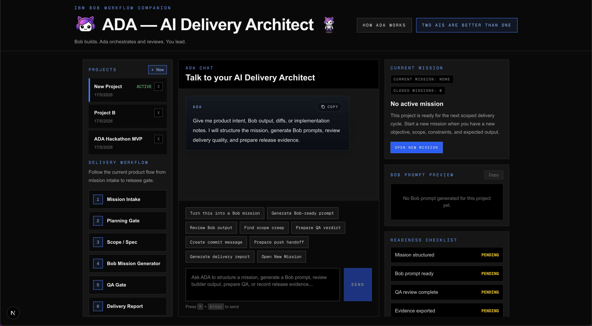

*Persistent project context, chat history, workflow state, Bob Prompt Preview, readiness checklist, and release gate — all in one screen.*

---

## Delivery in Detail

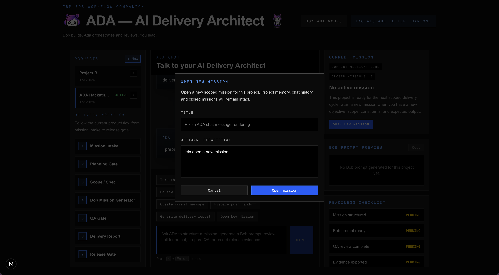

*Step 1 — A new mission is opened inside a persistent project workspace. Each mission is a scoped delivery cycle with its own context, records, and lifecycle.*

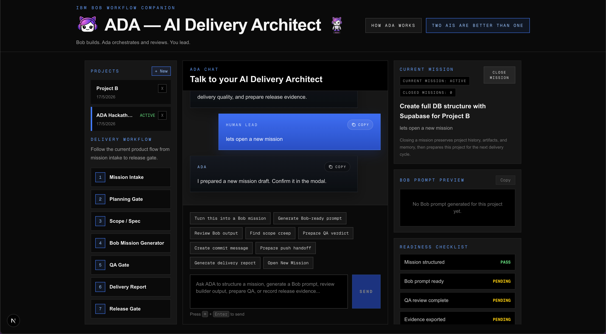

*Step 2 — The mission becomes active. ADA starts durable tracking immediately while preserving the project’s existing chat history, memory, and closed-mission context.*

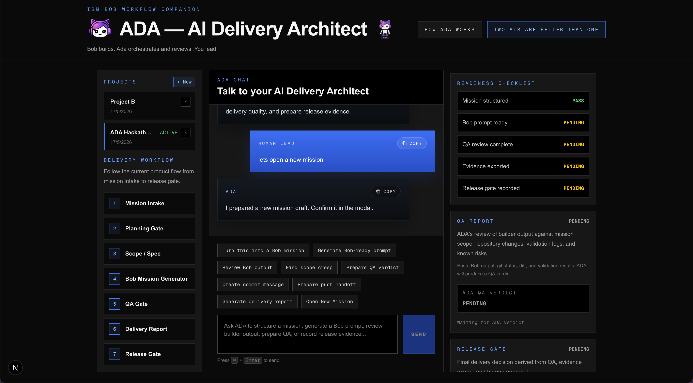

*Step 3 — ADA activates structured delivery tracking for the current mission. Scope, constraints, Bob prompt readiness, QA, evidence, and release state are tracked as separate gates.*

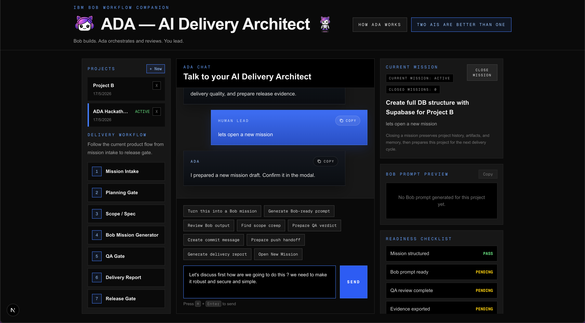

*Step 4 — ADA facilitates mission design before Bob touches the repository. The human lead and ADA clarify objective, constraints, risks, and implementation boundaries.*

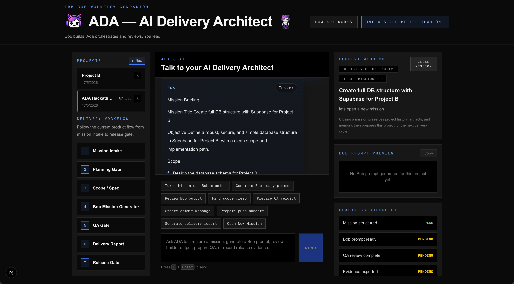

*Step 5 — Mission scope is finalized. Non-goals, acceptance criteria, validation requirements, and evidence expectations are made explicit before execution.*

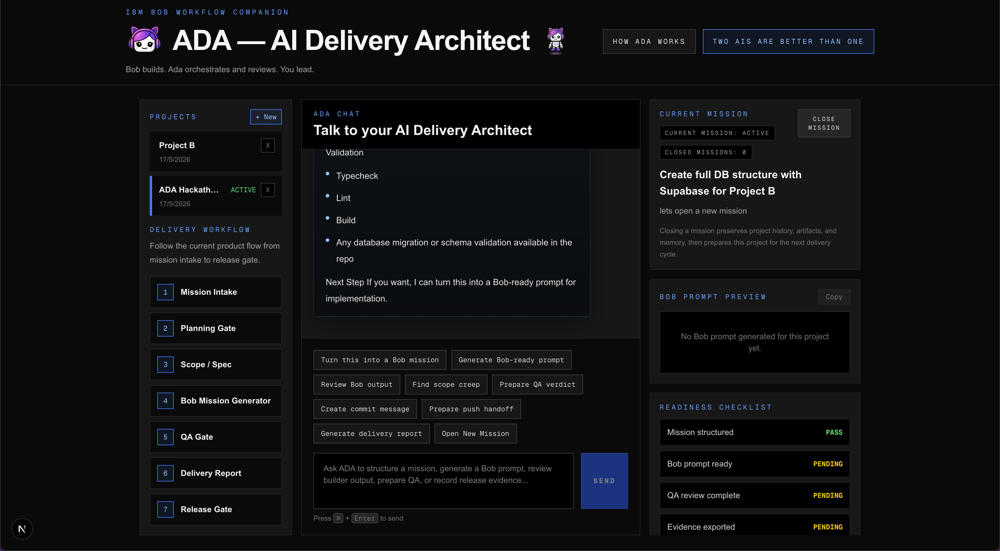

*Step 6 — The mission is fully briefed. ADA is ready to generate a clean, scoped implementation prompt for IBM Bob.*

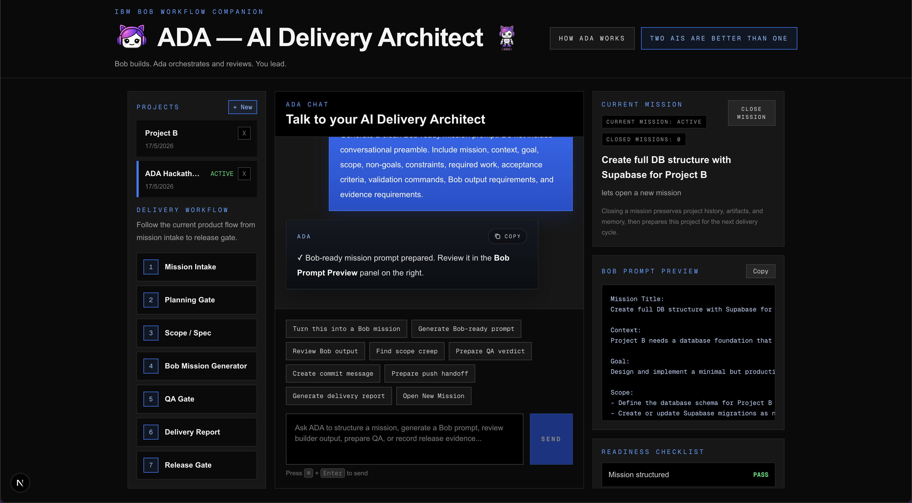

*Step 7 — Bob Prompt Preview. The full implementation prompt is staged in a dedicated panel — complete, scoped, and ready to paste into IBM Bob.*

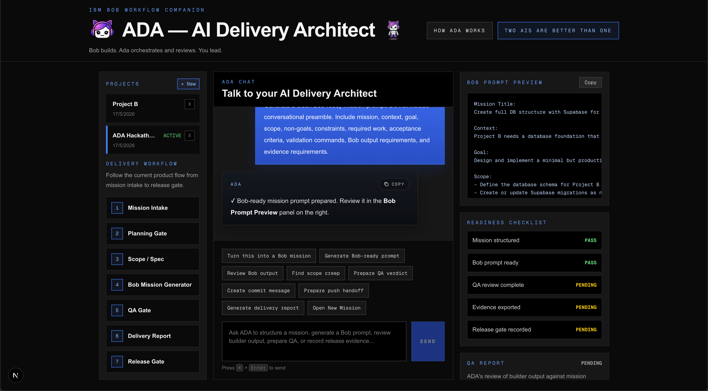

*Step 8 — After Bob executes, ADA tracks returned evidence against the delivery gates. Builder output, validation results, QA status, evidence export, and release readiness remain separate.*

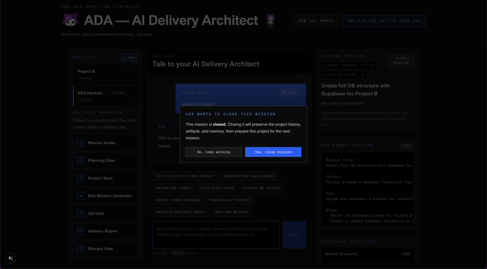

*Step 9 — ADA reviews Bob’s output against the scoped mission. A passing QA verdict makes the work eligible for a human release decision; closing the mission remains a controlled action.*

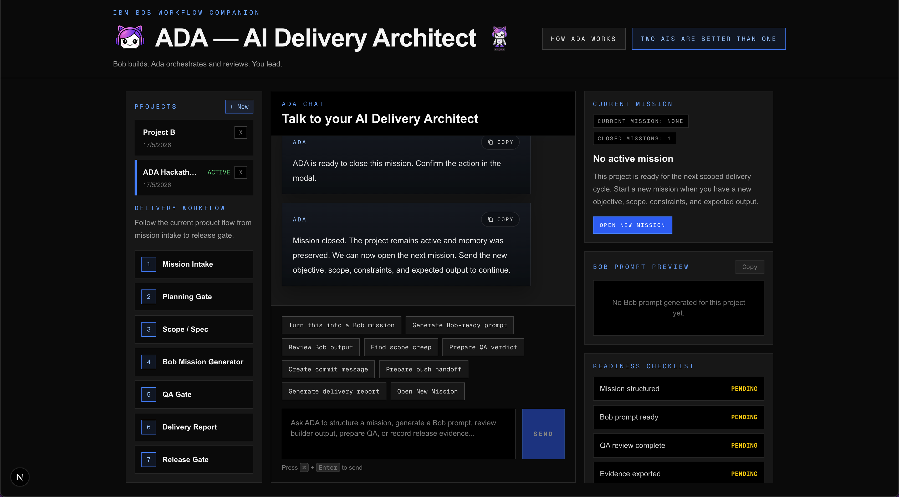

*Step 10 — Mission closed. The active delivery UI resets cleanly while project memory, chat history, archived artifacts, and closed-mission context remain intact. The next mission starts with complete project continuity.*

*Built-in onboarding explains the full delivery workflow without leaving the product.*

---

## How ADA Works

### 1 — Create or Select a Project

Each project is a persistent workspace with its own chat history, active mission, Bob prompt, QA reports, delivery evidence, release decisions, and memory summary.

### 2 — Describe the Mission

The human lead tells ADA what needs to be built. ADA turns rough intent into a scoped mission: title, objective, scope, non-goals, acceptance criteria, evidence requirements, and validation plan.

When no active mission exists, ADA names the latest closed mission and outcome, then signals readiness for the next scoped mission.

### 3 — Generate a Bob Prompt

Only on explicit request does ADA route the full implementation prompt to the Bob Prompt Preview panel. Mission briefings and intake confirmations do not generate `bob_prompt` artifacts. The prompt is persisted as a durable artifact when generated.

### 4 — Let Bob Build

The Bob prompt is pasted into IBM Bob. Bob works inside the repository, makes scoped changes, and returns implementation output.

### 5 — Bring Evidence Back

The human lead returns changed files, `git status`, `git diff`, validation results, known risks, and the builder summary. ADA reviews repository reality — not just the builder's account of it.

### 6 — ADA Produces QA

ADA derives a verdict from review output. Non-pending verdicts auto-record a durable `qa_report` artifact.

### 7 — Export Delivery Evidence

ADA exports a delivery report as Markdown and persists a `delivery_report` artifact. Readiness is only marked after persistence succeeds.

### 8 — Human Lead Records Release Gate

ADA recommends a release state from durable QA and evidence. The human lead records the final outcome.

### 9 — Close the Mission

Closing a mission preserves history, artifacts, and memory, then resets the active delivery UI for the next mission in the same workspace.

---

## Built Using Its Own Workflow

ADA was built using the delivery workflow it productizes.

IBM Bob was not a peripheral assistant in this repository. **Bob built the core.** The entire product foundation — scaffold, architecture, Supabase memory model, chat API, context builder, workspace model, Bob Prompt Preview routing, and the original delivery cockpit — was constructed by Bob across tracked, scoped missions.

| Builder | Missions | Role |
|---|---|---|
| IBM Bob | 19 of 37 (~51%) | **Core product build** — scaffold, Supabase memory, chat API, context builder, workspace model, Bob Prompt Preview routing, original cockpit |
| Codex (continuity) | 18 of 37 (~49%) | Polish, hardening, UX clarification, and recovery on top of Bob's established foundation |

Codex entered only after IBM Bob budget was exhausted, handling specific continuity missions to bring the MVP to final demo state. It did not replace Bob's role — it extended a core that Bob had already built and proven.

Every Bob session is preserved as evidence in [`bob_sessions/`](bob_sessions/) — structured, documented, and traceable, exactly as the hackathon requires.

> ADA proves the workflow it came from: Bob can build serious software, but production delivery needs a second layer for orchestration, review, evidence, and release control. Before ADA existed as product, GPT played that role with Bob. ADA is that proven workflow turned into software.
---

## Data Model

| Table | Purpose |
|---|---|
| `ada_workspaces` | Project containers for isolating mission and chat state |
| `ada_messages` | Persistent project chat history |
| `ada_artifacts` | Bob prompts, QA reports, delivery reports, release gate decisions |
| `ada_missions` | Mission rows for repeated delivery cycles inside the same project |
| `ada_memory` | Deterministic project memory derived from artifacts and mission state |

**Delivery Truth Model:** If mission record status and delivery artifact status differ, delivery artifact status is authoritative for release readiness.

---

## Tech Stack

| Layer | Technology | Version |
|---|---|---|
| Framework | Next.js App Router | 16.2.6 |
| UI | React | 19.2.4 |
| Language | TypeScript | ^5 |
| Styling | Tailwind CSS | ^4 |
| Database client | Supabase JS | ^2.105.4 |
| LLM layer | OpenAI-compatible API | ^4.77.3 |
| Monorepo | Turborepo + pnpm | latest / 10.0.0 |
| Evidence workflow | IBM Bob + Codex continuity | `bob_sessions/` / `others_sessions/` |

---

## Repository Structure

```
apps/web/                   Main ADA cockpit application
apps/web/components/        Chat, workflow sidebar, context panel, mission controls
apps/web/app/api/ada/       Server-side routes — chat, workspaces, messages, artifacts, missions
apps/web/lib/ada/           Prompt logic, context building, memory sync, types
supabase/migrations/        MVP schema foundation
docs/                       Source-of-truth product, workflow, and evidence docs
bob_sessions/               Official IBM Bob evidence for the hackathon
others_sessions/            Continuity and recovery evidence completed with Codex
packages/shared/            Shared types and constants
```

---

## Local Development

**Prerequisites:** Node.js, pnpm, Supabase project credentials, OpenAI-compatible model credentials.

```bash
pnpm install
cp .env.example .env.local
```

Configure in `.env.local`:

```
NEXT_PUBLIC_SUPABASE_URL
SUPABASE_SERVICE_ROLE_KEY
OPENAI_API_KEY
OPENAI_API_BASE_URL     # if using a non-default compatible endpoint
OPENAI_MODEL            # if overriding the default model
```

```bash
pnpm dev
```

**Validation gate:**

```bash
pnpm typecheck
pnpm lint
pnpm build
```

Plus manual browser validation for UI changes and `git status --short` / `git diff --stat` before any release handoff.

---

## Current Hackathon Scope

This hackathon MVP intentionally excludes auth, billing, GitHub OAuth, vector DB, pgvector, client-side Supabase access, automatic push without human approval, and secrets in the repository.

The product is narrow by design: a delivery control cockpit for IBM Bob workflows, not a full enterprise platform.

---

## Source of Truth

- [`docs/ADA_SPEC.md`](docs/ADA_SPEC.md)
- [`docs/DELIVERY_WORKFLOW.md`](docs/DELIVERY_WORKFLOW.md)
- [`docs/HACKATHON_EVIDENCE.md`](docs/HACKATHON_EVIDENCE.md)
- [`AGENTS.md`](AGENTS.md)

---

<div align="center">


&nbsp;&nbsp;&nbsp;&nbsp;&nbsp;&nbsp;
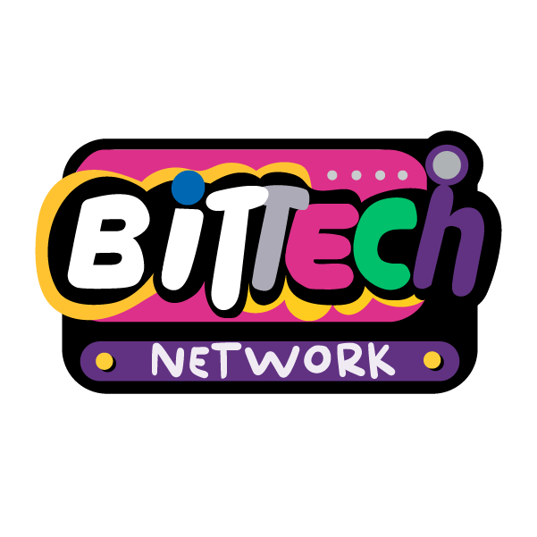

<br /><br />

**ADA — AI Delivery Architect**  
*Bob builds. Ada orchestrates and reviews. You lead.*

<br />

Built by [**Bittech Network**](https://www.bittechnetwork.com) — Tech Studio 

</div>